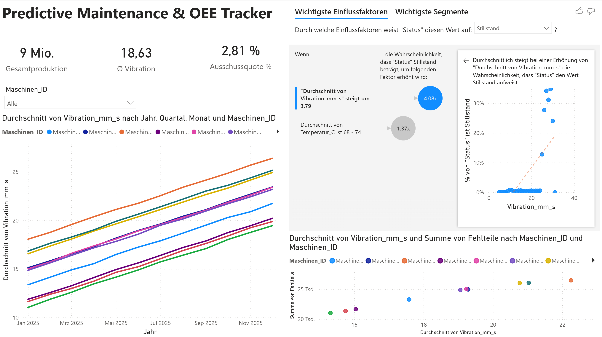

# Predictive Maintenance Dashboard



*A Power BI predictive-maintenance dashboard for a simulated German injection-molding factory: one year of hourly sensor data (**87,600 records across 10 machines**) that pinpoints the physical driver of unplanned downtime — machine **vibration** — and the exact threshold at which to act.*

---

## The problem

A typical mid-sized German `Kunststoffwerk` runs on **reactive maintenance**: machines run until they break. The costs stay invisible until they hurt:

- Unplanned downtime crushes **OEE** (Overall Equipment Effectiveness).
- Scrap rates climb silently as worn components drift out of spec.
- Maintenance crews are dispatched *after* a failure, without knowing **why** it happened.

The question the shop floor actually needs answered: **which sensor signal warns us early, and at what value do we intervene?**

## The solution

A Power BI `.pbip` dashboard over a simulated year of operations that surfaces the **root cause of stoppages** with Power BI's **Key Influencers** visual — a logistic-regression-style driver ranking, no trained ML model required.

**The finding:** machine **vibration** is the dominant leading indicator. Once `Vibration_mm_s` crosses **~25 mm/s**, the probability of a machine entering downtime jumps roughly **60×** (from ~0.5% to ~30% per hour); temperature and machine ID are secondary.

**The takeaway:** **25 mm/s is the actionable early-warning threshold.** Any machine crossing it is flagged for inspection within the current shift — turning a reactive workflow predictive with a single number, not a model.

The screenshot above: total production, average vibration and scrap rate as KPIs; the year-long vibration climb (wear) per machine; and, on the right, Key Influencers showing vibration as by far the strongest driver of `Status = Stillstand`.

## Features

- **OEE KPIs** — total production, average vibration, scrap rate (DAX measures).
- **Vibration trend** — hourly vibration per machine across the year makes the wear drift visible.
- **Key Influencers (AI)** — ranks what drives downtime; vibration dominates.
- **Scrap vs. vibration** — a scatter linking quality loss to the same signal.
- **Data-quality handling** — 100 temperature readings are intentionally `NaN` to exercise Power Query cleaning.

## Tech stack

| Layer | Tooling |
| --- | --- |
| Data simulation | **Python 3.10+**, `pandas`, `numpy` (pinned) |
| Storage | CSV — semicolon-delimited, **comma decimal** (de-DE), UTF-8 |
| BI / modeling | **Power BI Desktop** — `.pbip` project format (source-control friendly) |
| Measures | **DAX** (production, scrap %, Ø vibration) |
| AI / analytics | Power BI **Key Influencers** |

## Installation

```bash
git clone https://github.com/baris2828/predictive-maintenance-dashboard.git
cd predictive-maintenance-dashboard
python -m venv .venv
source .venv/bin/activate        # Windows: .venv\Scripts\activate
pip install -r requirements.txt

python generate_factory_data.py  # -> production_big_data.csv (87,600 rows) + sample_data.csv
```

Then open `Produktions_Monitoring.pbip` in **Power BI Desktop** (2.124+), point the `production_big_data` query at your local `production_big_data.csv`, and **Home → Refresh**. The checked-in `sample_data.csv` shows the data shape without regenerating.

> **Locale note:** the semantic model's culture is **de-DE**, so the CSV is written German-formatted (`;` separator, `,` decimal). This matters — with `.`-decimals Power BI reads `15.34` as `1534` and vibration appears ~100× too high.

## Data dictionary

| Column | Type | Description |
| --- | --- | --- |
| `Zeitstempel` | datetime | Hourly reading (2025-01-01 00:00 → 2025-12-31 23:00) |
| `Maschinen_ID` | string | `Maschine_01` … `Maschine_10` |
| `Vibration_mm_s` | float | Sensor vibration (mm/s); drifts upward over the year (wear) |
| `Status` | string | `Produktion` or `Stillstand` |
| `Produzierte_Stueck` | int | Parts produced in the hour (0 during downtime) |
| `Fehlteile` | int | Scrap count; grows with vibration |
| `Temperatur_C` | float | Operating temperature; 100 values intentionally `NaN` |

## Learnings

- **The correlation is synthetic — by design, and stated plainly.** `generate_factory_data.py` deliberately engineers the vibration→failure link (`>25 mm/s → ~30%` hourly failure vs. `~0.5%` below). This project demonstrates the **end-to-end analytics workflow and BI/AI tooling**, not a discovery on real sensor data — and says so.
- **Predictive without a model.** Key Influencers yields a logistic-style driver ranking and one actionable threshold — decision support *before* anyone trains and deploys an ML model.
- **Locale bites data pipelines.** The de-DE model read `.`-decimals as thousands separators, so `15.34 mm/s` silently became `1534` — vibration showed ~100× too high. Writing the CSV German-formatted (`;` + `,`) fixes it at the source. "The numbers look 100× off" is usually an encoding/locale bug, not the analysis.
- **`.pbip` is version-control friendly.** Report layout and the semantic model live as text (JSON/TMDL), so the dashboard diffs and reviews like code — unlike a binary `.pbix`.

## License

MIT — see [`LICENSE`](LICENSE).
